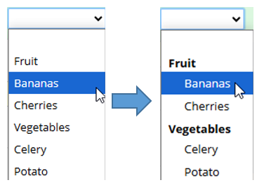
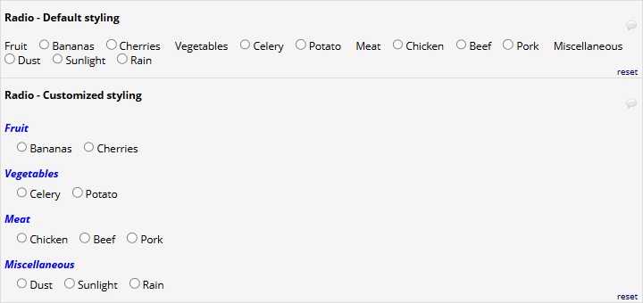

# REDCap OptGroup

This module allows a project designer to modify the choices of a dropdown, radio, or checkbox field to display the labels of selected choices as option groups or headers, where the choices are not selectable, but serve to group the selectable options into labelled groups.

When annotating a dropdown/radio/checkbox field with `@OPTGROUP='1,4,6'`, choices coded `1`, `4` and `6` are not selectable, but instead their labels are used as the group labels of the other options.

Set it up like so:


To get this:



`@OPTGROUP` is compatible with Multi-Language Management.

## Installation

Install the module from the REDCap module repository and enable in the Control Center, then enable on projects as needed.

## Usage

This module adds the action tag `@OPTGROUP`. It can be applied to **radio** and **dropdown** type fields and requires a string parameter (single or double quotes) with a comma-separated list of choices. These choices will be then be rendered as headers or group labels, respectively, and will not be clickable/selectable.

E.g., `@OPTGROUP='x,y,z'` will make render the choices `x`, `y`, and `z` as headers/group labels.

## Styling

If you don't like the default looks, the headers' appearance can be customized with CSS styles.

For dropdowns, styling of headers is quite limited in current browsers. You can use CSS like this, though:
```css
<style>
  select[name='fieldname'] optgroup[choice='x'] {
    color: red;
  }
  select[name='fieldname'] optgroup[choice='x'] option {
    color: black;
  }
</style>
```

Note that the `<option>`s are nested inside the `<optgroup>`, and thus inherit the styles, which requires that they be set (back) to their default values explicitly.

For radio groups, styling can be applied to the choice labels directly in the choices editor. For LH and RH alignment, `<br>` tags can be inserted before and/or after the label to force wrapping.

### Advanced styling

The class **optgroup-header** is added to the `<label>` elements modified by the `@OPTGROUP` action tag. Depending on the type (radio, enhanced radio, dropdown), the following classes are added additionally: **optgroup-radio**, **optgroup-enhradio**, **optgroup-drowndown**.

These can be used to facilitate styling of the headers. For example, to style grouped LH radio buttons, use CSS like this:
```css
<style>
  label[data-mlm-field="styled_radio"].optgroup-header {
    color: blue;
    display: block !important;
    font-weight: bold !important;
    font-style: italic;
    margin-top: 1em;
  }
</style>
```
This will turn the default looks (top) into something much more appealing:




## Limitations

This module does **not** work with _autocomplete_ dropdowns due to the way these are rendered in the browser. When the action tag is applied to a dropdown field with autocompletion enabled, the choices marked as option group headings will be removed from the dropdown entirely.
