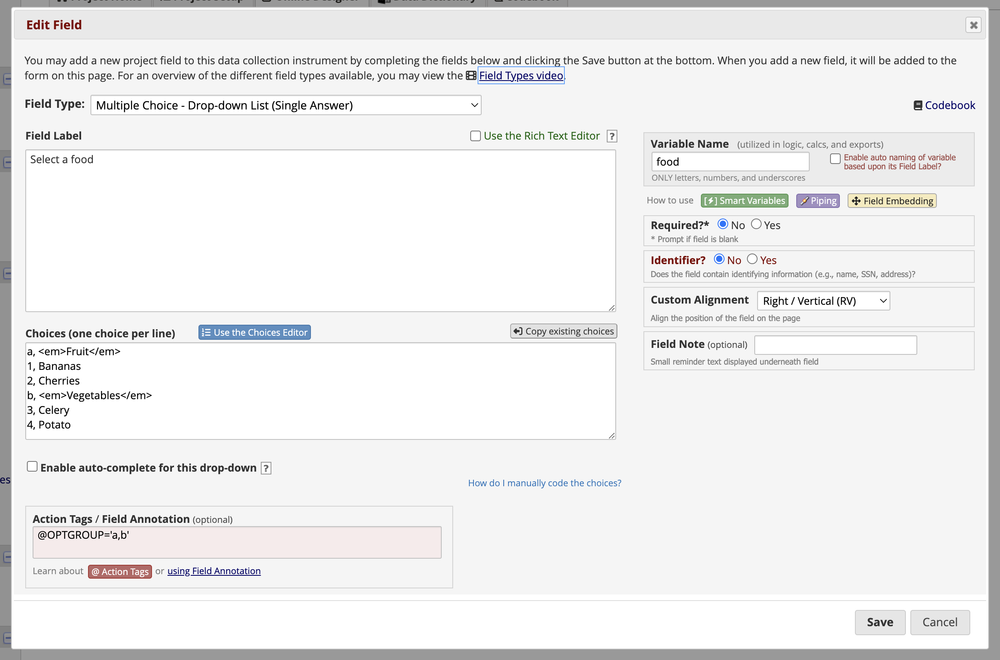
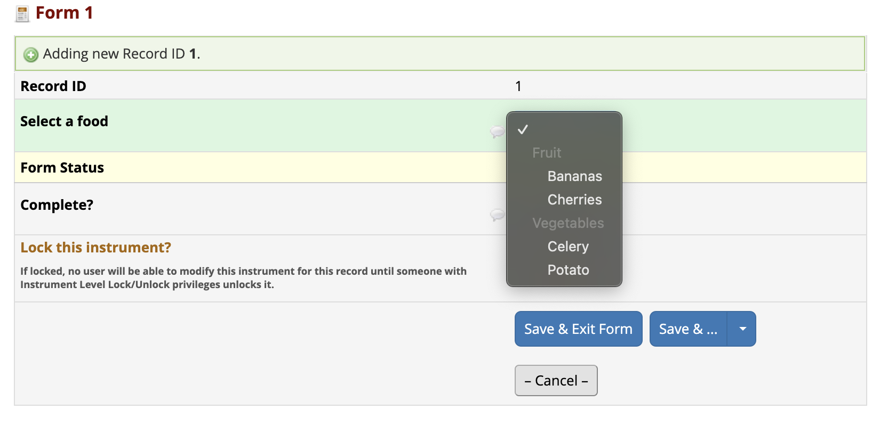
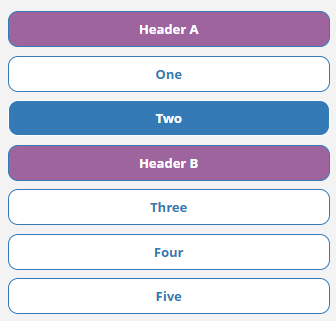

# REDCap OptGroup

This module allows a project designer to modify the choices of a dropdown or radio field to display the labels of selected choices as option groups or headers, where the choices are not selectable, but serve to group the selectable options into labelled groups.

When annotating a dropdown field with `@OPTGROUP='1,4,6'`, choices coded `1`, `4` and `6` are not selectable, but instead their labels are used as the group labels of the other options.

Go from this:



To this:



`@OPTGROUP` is compatible with Multi-Language Management.

## Installation

Install the module from the REDCap module repository and enable in the Control Center, then enable on projects as needed.

## Usage

This module adds the action tag `@OPTGROUP`. It can be applied to **radio** and **dropdown** type fields and requires a string parameter (single or double quotes) with a comma-separated list of choices. These choices will be then be rendered as headers or group labels, respectively, and will not be clickable/selectable.

E.g., `@OPTGROUP='x,y,z'` will make render the choices `x`, `y`, and `z` as headers/group labels.

## Styling of headers

For dropdowns, styling of headers is quite limited in current browsers. You can use CSS like this, though:
```css
<style>
  select[name='fieldname'] optgroup[choice='x'] {
    color: red;
  }
  select[name='fieldname'] optgroup[choice='x'] option {
    color: black;
  }
</style>
```

Note that the `<option>`s are nested inside the `<optgroup>`, and thus inherit the styles, which requires that they be set (back) to their default values explicitly.

For radio groups, styling can be applied to the choice labels directly in the choices editor. For LH and RH alignment, `<br>` tags can be inserted before and/or after the label to force wrapping.

### Advanced styling

The class **optgroup-header** is added to the `<label>` elements modified by the `@OPTGROUP` action tag. Depending on the type (radio, enhanced radio, dropdown), the following classes are added additionally: **optgroup-radio**, **optgroup-enhradio**, **optgroup-drowndown**.

These can be used to facilitate styling of the headers. For example, to style enhanced radios, use CSS like this:
```css
<style>
.optgroup-header.optgroup-enhradio {
  background-color: #9d649d;
  color: white;
  font-weight: bold;
}
</style>
```
This will give something like this on surveys with enhanced radios:



Note that both classes need to be specified for the CSS to have enough specificity to override REDCap's built-in styling.


## Limitations

This module does not work for dropdowns where autocomplete is enabled due to the different DOM structure for dropdown fields in those cases. To prevent the inadvertent selection of choices that would otherwise have been converted to option groups, the option group choices are removed from the dropdown entirely.

Perhaps a future version will implement support for autocomplete dropdowns.

Enhanced checkboxes are also not currently supported.
